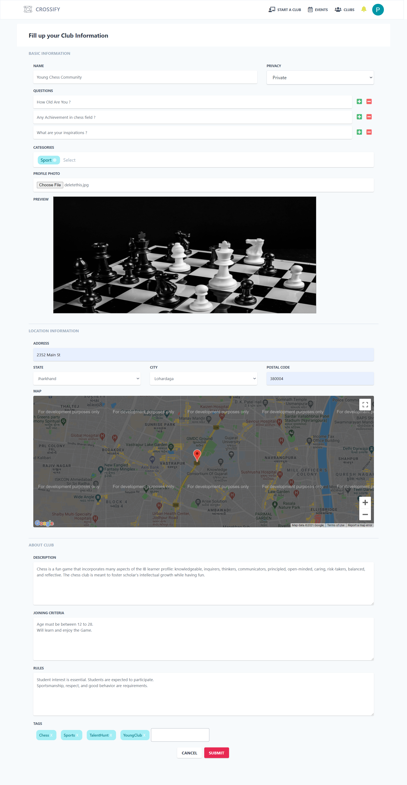

## Snapshots

**Software Requirements Specification for Crossify**

**Prepared by Crossify TEAM**

**Vishwakarma Government Engineering College**

**Table of Contents**

**1. Introduction **

1.1 Purpose
1.2 Document Conventions
1.3 Intended Audience and Reading Suggestions
1.4 Project Scope
1.5 References

**2. Overall Description **

2.1 Product Perspective
2.2 Product Features
2.3 User Classes and Characteristics
2.4 Operating Environment
2.5 Design and Implementation Constraints
2.6 User Documentation
2.7 Assumptions and Dependencies

**3. System Features **

3.1 System Feature 1
3.2 System Feature 2 (and so on)

**4. External Interface Requirements **

4.1 User Interfaces
4.2 Hardware Interfaces
4.3 Software Interfaces
4.4 Communications Interfaces

**5. Other Nonfunctional Requirements **

5.1 Performance Requirements
5.2 Safety Requirements
5.3 Security Requirements
5.4 Software Quality Attributes

**6. Other Requirements **

**Appendix A: Glossary **
**Appendix B: Analysis Models **

**_Software Requirements Specification for Crossify Web Appication***

# **Introduction**

## **_Purpose_**

  The purpose of this document is to present a detailed description of the Crossify Web Application. It will explain the purpose and features of the application, the interfaces of the application, what the application will do, the constraints under which it must operate and how the application will react to external stimuli. This document is intended for both the stakeholders and the developers of the application.

## **_Document Conventions_**

This document uses the following conventions.
- Bold words are important.
- Admin means the operator in the application.
- Users means public who using application.
- Moderators joins admin and users.

## **_Intended Audience and Reading Suggestions_**

` `This document is intended to be used by members of the project team that will implement and verify the correct functioning of the system as well as the guide who is responsible for providing useful feedback for betterment of the project. This has been implemented under the guidance of college professors. This project is useful for the community of every kind and the basis of community can be anything from career to curiosity

  This project is geographical based interest group provider and manager and it is restricted within the college premises.

## **_Project Scope_**

` `Crossify is geographical based interest group provider and manager where one can build a community and manages it with other members of community. It is community driven Web App where the core objective is to provide powerful platform to flourish one’s interest , build a stronger and helpful community and promote real world events based on geographical location.

` `It is application which follow principle of democracy , for the people by the people and of the people. Developing community around the region which will managed by the people for the people. Flourishing one’s interests and unites like minded people in real world.

## **_References_**

- WikiPedia
- GeeksForGeeks
- TutorialsPoint

# **Overall Description**

## **_Product Perspective_**

` `The product aims to build and accelerate the community growth by providing strong medium of internet to bring exposure to localized groups ,flourish one’s interest and bring likeminded people together to grow as individual as well as community. The product is capable of building community from scratch with minimal effort. It provides large exposure to the local people to promptly create a club based on niche which can be related to almost anything. The product focuses on bringing people close, hosting and managing event and making them aware of ongoing events nearby.

## **_Product Features_**

` `Crossify facilitates users by giving them functionality to freely create a club and adjust according their needs which can be varies from adjusting the access and joining criteria to selecting the generalized category the club belongs. Club Creator can promote members to moderator which has quite a few authorization than members of groups. Product provides a platform to host the event and organize it well. Club stakeholders can interact with each and others be friend each other’s profile. Clubs can have multiple conversation rooms which have unique agenda depending on the room so users can experience ease of clarity and moderator can easily filter out the important points and handles the request/feedback properly.

## **_User Classes and Characteristics_**

There are mainly 4 classes of users , characteristics of each one is described as below.

- **Creator :** Creator is stakeholders of product which is responsible for creating a club and managing the club. Managing clubs consists several authorization and responsibility as a creator which is assign roles(promoting to moderators) , accepts or reject event proposal and providing fruitful feedback or guidance to the members. Configuring Joining criteria and all the meta information can be changed by the creator. It has access to delete a club , too.
- **Moderators :** Moderators are the members who got promoted by the creator of club. Club moderator has all the authorization just like creator of group but with few restriction such as not having authority to promote a member , deleting group.
- **Club Members :** Club Members are the core audience of the group where member can join the events , ask question , connect with club members , send/accept friend requests. Club members has access to propose a event to the moderator/Creator.
- **Users :** Users are the external audience of the group , they are not a member of the group yet they can search through all related groups or nearby events , attend events , join groups, create a group on their own. After joining a club, they can posses all the functionality of club members and same goes for creator/moderator.

**Note :** All the users are expected to be Internet literate and be able to use a search engine."_

## **_Operating Environment_**

Operating environment for the airline management system is as listed below.

- Distributed Database (Large scale)
- Dedicated Server
- OS: Windows
- Database Cluster : MongoDB
- Back-End : ExpressJS (NodeJS framework)
- Front-End : React
- Geographical location supported web browser (preferred)
  ## **_Design and Implementation Constraints_**
- The computers must be equipped with web browsers such as Google Chrome.
- Geographical location access should be on from the web browser for the website.
- The product must be stored in such a way that allows the client easy access to it.
- Response time for loading the product should take no longer than five minutes.
- A general knowledge of basic computer skills is required to use the product.
- The algorithm for finding nearby events must be optimal so the processing time can be minimized.
- Recommendation of events/Clubs should be accurate for individual users.
  ## **_Assumptions and Dependencies_**
- Clubs’ moderators/creator is unbiased and active in the club and contributes to the community.
- All the Events are genuine and trustworthy.
- The Users expected to have proper literacy in computer/internet world.
- There is no scamming or theft activities in the system.
- Server is fast and secure from any malicious activities.

  # **System Features**
  ## **_Search and Explore Feature_**
  3.1.1 Description and Priority

` `Search panel provides multiple filters to find the related events/clubs depending on your preferences. It has various parameters other than query string. The parameters consist Location, Club/Event, Club Member strength, Category, Date of event, Event Popularity, online/offline events etc. The Explore feature recommends related clubs and events for the users based on users’ preference and location. User can favorite event on this page, too.

3.1.2 Stimulus/Response Sequences

Stimulus : User wants search nearby events which satisfy few parameters.
Response : The system process the request and responses with suitable events which checks all the requirements.

Stimulus : User request for home of the system.
Response : Popular events and Popular Clubs information is presented to users to choose from.

Stimulus : User favorites events or clubs on the explore page.
Response : Events Information is appended to favorite section of users so user can access it easily.

Stimulus : User wants to favorite events or clubs which he found on the explore page.
Response : Events Information is appended to favorite section of users so user can access it easily in future.

Stimulus : User wants to share the events to his friends/family through other social media.
Response : The system provides sharable link for the particular club or events the user selected which can easily share in multiple platform such Instagram, WhatsApp , Telegram , Facebook , Twitter.

3.1.3 Functional Requirements

1. Communicate in the clubs.
1. Create an event.
1. Make friends.
1. Join the events.

## **_Creating and Managing Club as a Creator_**

3.2.1 Description and Priority

  Users can create a club on their own with few information to fill with. This function is core functionality of the system so the priority of the feature is utmost. The Creation of club consists many meta information of club so other users can easily understand what’s the club about and the creator of the club will be assigned utmost priority in club.

  The requirements for this feature set describe how the system provides and controls sharing, collaboration, and access rights. All users are authenticated prior to using the system. They are also assigned a user role. User roles are used to perform authorization for certain tasks within the system. The user's authentication is also used by the system to discern authorization rights for specific operation. System Administrators(Creator) have the ability to manage user and user roles(Moderator/Member).

3.2.2 Stimulus/Response Sequences

Stimulus : User wants to create a new club.
Response : The system ask few important information about the club such as keywords , description , rules of the club , category of the club, Location , Images.

Stimulus : Creator of club wants to invite some friends in the group thorough sharable link.
Response : The system provides sharable link for the club which can easily share in multiple platform such Instagram, WhatsApp, Telegram , Facebook , Twitter.

Stimulus : Creator of the club wants to elect moderators for the club.
Response : The system enlist members of the club so creator can choose the candidate as a moderator which can have various privileges in the club.

Stimulus : Creator wants to edit information of Club.
Response : The system provides existing information of club and allow creator to modify the information related to Club. Creator can edit Profile Photo , Background Photo , Rules section , Toggle Club Joining requirements , keywords of the club , Location , Description of the club.

Stimulus : Creator wants to change privileges given to members.
Response : The system provide broad view of members and their privileges. The system facilitates users with functionality to change the status/position of members in the club. The promotion as a moderator and vice versa. Creator can remove members from the group, too.

3.1.3 Functional Requirements

- Communication in the clubs
- Create an event
- Make Friends
- Join the Events

## **_Handling Club as a Moderator_**

3.1.1 Description and Priority

` `There is numerous responsibility as a manager of club which requires support from other members too. Because of excessive duty as manager the system must provide multiple members access to edit/accept/reject various requests. Note that all privileges and authorization of moderator is subset of Creators’ privileges.

3.1.2 Stimulus/Response Sequences

Stimulus : Moderator wants to accept/reject request for a member which wants to join the club.
Response : The system has dedicated section to go through all the requests which was done by the users which are not a member of the club yet. It only available if the club restricted to invites only.

Stimulus : Moderator wants to examine the new proposals of events proposed by the member.
Response : Detailed view of event proposal is presented to the moderator so the moderator can decide it is appropriate to broadcast or needs some modification or does follow the club guidelines. All the conversation to the event proposal can be done in this section.

Stimulus : Moderator wants change the broadcasting/promoting date of the event.
Response : Customization of broadcasting date is provided to the moderator so they can schedule it according to the requirements.

Stimulus : Moderator wants to favorite events or clubs which he found on the explore page.
Response : Events Information is appended to favorite section of users so user can access it easily in future.

Stimulus : Moderator wants to create a chat room and set its visibilities.
Response : New Chat room will be added to the club and the visibilities of the chat room is defined by the moderator.

Stimulus : Moderator wants to schedule a event for the club members/other users of crossify.
Response : The System publish the event to the upcoming events and certain users can access it according to the restriction the moderator configured while creating the event. All the event management feature is facilitated to the moderator which published it.

## **_Event Management Tools_**

3.1.1 Description and Priority

` `This section consists all the customization and privileges of event manager. Member of Club can propose an event through this functionality. The proposal requires to have proper information about events so authorized person can easily summarize it and approve it if it does have any problem. All the statistics and Metadata about the event can be accessed/modified by this feature. Note that Moderator does have any approval process for their events. By default, all the events are approved which is published by one of the authorized moderator of the club.

3.1.2 Stimulus/Response Sequences

Stimulus : Member aims to propose an event for the club (other can participate too).
Response : The system ask key information about the events such as description , prerequisite, eligibility , Fees ,Date and time ,duration , Category , Mode of hosting(online/offline) , location , FAQ section , Tags , Exposure configuration , Last Date for registration . All the Information is collected through form and it will broadcast to all the moderators to get acceptance.

Stimulus : Member wants to add Volunteer.
Response : Volunteer can be added from the members of club but they have to accept the responsibility first.

Stimulus : Member wants to check status of proposed event.
Response : Event Section provides useful information about all the events which was proposed by the users and it’s also represents the status.

Stimulus : Member wants to see how many participates are coming to the event.
Response : Event section facilitates with all the information of registered members.

Stimulus : Member wants to allows participated from the club only.
Response : Exposure configuration changed to Club members only so the visibility of the event is restricted to the club.

Stimulus : Member wants to check why the proposal got rejected.
Response : The system responses with clear explanation and feedback from the moderator for the event and why it got rejected and what can you do about to get acceptance from the moderator.

Stimulus : Member wants to answer the question which was asked by the audience/users of system.

Response : All the question asked by the users for the particular event is compiled together and presents to the event creator so they can reply with the answer and most frequent questions can be added in FAQ section of the event, too.

Stimulus : Member wants to take attendance of all the participates of the event and wants to see feedback from them.
Response : All the registered users of the events is presented to the event manager and they can select which participate attended the event and see the feedbacks(ratings) as well.

## **_Club Amenities_**

3.1.1 Description and Priority

` `This section consists all the facilities the club provides to the members. It consists asking question, interacting with other members, explore through upcoming events, polling ,see old events and it participates. All the activities as a member in considered in club amenities.

3.1.2 Stimulus/Response Sequences

Stimulus: Users wants to remove problematic members.
Response: The system counts number of report the user got if it exceeds the threshold of allowed complain then the user will be removed from the group and it will have 24 hour cooldown (not allowed to join or request).

Stimulus: Users wants ask a question in the group.
Response: The system facilitates the club with various chat rooms created by the moderators which consists Q & A room as well. The question will be appended to the chat room with username.

Stimulus: Users wants express his views through vote.
Response: The system provides a polling feature to quickly collect all the view of members.

Stimulus: User wants to see upcoming events of club.
Response: Clubs has dedicated section for the events where it shows all the details of events and it participates,

Stimulus: User wants to interact with other club members.
Response : Public Chat room is available for all the members.

Stimulus : Users wants to ask question regarding a event.
Response : All the events can be found in Event Info and Question can be asked by this.

Stimulus : User wants to who is coming to the event.
Response : Events section has all the names of registered users.

# **External Interface Requirements**

## **_User Interfaces_**

` `The user interface for the software shall be compatible to any browser such as Internet Explorer, Mozilla or Netscape Navigator by which user can access to the system. The user interface shall be implemented using any tool or framework like React etc*.* Users accessing the system from a consistent location will want a more robust interface. This rich client shall provide the full feature set to the user.

## **_Hardware Interfaces_**

` `Since the application must run over the internet, all the hardware shall require to connect internet will be hardware interface for the system. As for e.g. Modem, WAN – LAN, Ethernet Cross-Cable.

## **_Software Interfaces_**

1. The System shall use various Content authoring and viewing tools as they are needed and/or available.
- Google Chrome
- Internet Explorer
- Mozilla FireFox

2. The system shall schedule events in proper data structures.

3. The system shall use Socket.io for chat room functionality.

4. The system shall access google maps API for accurate location navigation and representation.

5. The system shall make use of HTTP and HTTPS protocols as needed for publishing and transfer.

6. The system shall make use of various networking protocols such as TCP/IP and UDP.

7. The system shall make use of database technologies and NoSQL for user information, backup, and live storage as necessary.

# **Other Nonfunctional Requirements**

## **_Performance Requirements_**

` `The system should perform quick computation of distance between nearby places within 5-10 seconds at max. All filtration of searched items should be done in at most 5 second. Distributed Database must have less response time.

## **_Safety Requirements_**

Safety Requirements are out of the scope of this SRS.\*\*

## **_Security Requirements_**

` `Personal data of users can not be shared with other members. Moderator privileges must be restricted to authorized users only. All sensitive data of events cannot be public. Database must not allow any unauthorized access from the hackers.

## **Software Quality Attributes**

**Availability :** The server should be up to date with all the data from every distributed database. Any Server must be up for 99% of time.

**Accuracy** : The system must determine accurate location of member and support Maps navigation as well to improve the usability of the product.

**Usability** : The system must fulfill the preference of users and can be scalable to other locations, too. Any crashes of server must redirect the requests to other running server so the users doesn’t face any problem.

**Maintainability** : The system must maintain a proper scheduling of the events and its registered participates. Any changes can be made during the events as well and the system must be flexible enough to handle large load of traffic.

# **Other Requirements**

**Appendix A: Glossary**
SRS: Software Requirements Specifications
Event: This term defines an occasion which is created by the admin.
Admin: This term defines a head of club, creator of club.
Club: This term defines a group of people at on particular place.
Chat Room: This term defines communication area under the club.
Moderator: This term defines a person who handles all the activities in the club associated with admin. This member is chosen by the admin of club.

**Appendix B: Analysis Models**

 

